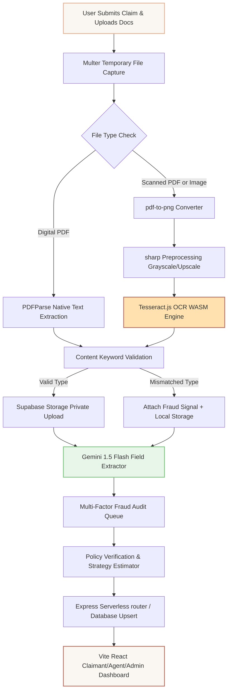

# 🛡️ ClaimX: Multi-Line Insurance Claims Automation Platform

<div align="center">
  
</div>

ClaimX is an end-to-end, multi-role insurance claim automation platform. It features real-time PDF parsing, local WebAssembly OCR, content-based document validation, multi-rule fraud detection, and a strategy-pattern payout estimator powered by Gemini AI and Supabase.

---

## 🛠️ System Architecture & Data Flow

Here is a visual flowchart of how ClaimX processes an insurance claim and parses uploaded files:



---

## 🚀 Key Features

*   **⚡ Native PDF Text Layer Extraction**: Extracts native text directly from digital PDFs in milliseconds using the modern ESM `PDFParse` module.
*   **👁️ WebAssembly Scanned OCR Fallback**: Scans image-only or scanned documents using `tesseract.js` inside a sandboxed WebAssembly worker, with image optimization via `sharp`.
*   **📂 Document Type Verification**: Checks document content keywords at the upload step (e.g., verifying a death certificate contains "death" and "deceased"), flagging mismatches automatically.
*   **🧠 Gemini Flash Extraction**: Feeds extracted document text directly into Gemini 1.5 Flash to pull structured claim values.
*   **🕵️ Rule-Based Fraud Engine**: Combines base and type-specific policy rules, triggering fraud flags for inconsistent dates, sum-insured limit breaches, or file content validation failures.
*   **⚖️ Strategy Pattern Estimator**: Calculates estimated claim payouts using clean strategy patterns matching the user's specific product line.
*   **🔌 Graceful Offline Fallback Mode**: If Supabase parameters are missing, the server degrades to local mock database operations, allowing offline testing.

---

## 💻 Tech Stack

*   **Frontend**: React 19 (TypeScript, Vite, Lucide icons, Motion animations)
*   **Backend**: Node.js, Express, Multer
*   **Document Analysis**: `pdf-parse` (ESM version), `tesseract.js` (WASM), `sharp`, `pdf-to-png-converter`
*   **Database & Security**: Supabase (Auth, Storage, public.users & claims RLS tables)
*   **AI Orchestration**: Gemini API (`@google/genai` sdk)

---

## 🧑‍💻 The Development Team

Meet the engineers behind the implementation of the ClaimX automation platform:

| Engineer | Focus Area | Contributions |
| :--- | :--- | :--- |
| **Preetham** | 🗄️ Database, Version Control & DevOps | Designed Supabase tables, configured database Row-Level Security (RLS) policies, managed git merges, and structured the project for serverless deployment. |
| **Chinmaya** | 🎨 Frontend UI/UX | Created the React claimant dashboards, the Agent review timeline, the Admin analytics charts, and built the New Claim Intake wizard. |
| **Naushin & Chandana** | ⚙️ Backend, OCR & AI Pipeline | Built the Express API routing system, implemented the multi-stage OCR extraction and validation service, and programmed the Gemini AI fraud analysis pipeline. |

---

## ⚙️ Local Development Setup

### 1. Configure your environment variables
Create a `.env` file at the root of the project:

```ini
# Gemini API Key
GEMINI_API_KEY="your-gemini-api-key"

# Supabase Configurations (Dashboard -> Settings -> API)
SUPABASE_URL="https://your-project.supabase.co"
SUPABASE_SERVICE_ROLE_KEY="your-service-role-secret-key"

VITE_SUPABASE_URL="https://your-project.supabase.co"
VITE_SUPABASE_ANON_KEY="your-anon-public-key"

# App URL
APP_URL="http://localhost:3000"
```

*Note: If these variables contain the default template strings, ClaimX will run in **Graceful Offline Fallback Mode**, allowing you to test file uploads and claims processing offline.*

### 2. Install dependencies & Run
```bash
# Install dependencies
npm install

# Start local server (Express + Vite hot reload)
npm run dev
```

Open **http://localhost:3000** in your browser.

---

## ☁️ Vercel Serverless Deployment

ClaimX is pre-configured to build and run as a serverless function on Vercel:

*   **Vercel Routing**: The [vercel.json](vercel.json) file routes static assets to Vercel's edge cache, and redirects API endpoints to the Express handler at `api/index.ts`.
*   **Writable /tmp Folder**: OCR cache is redirected to the `/tmp` folder, preventing read-only filesystem errors (`EROFS`) in Vercel's serverless environment.
